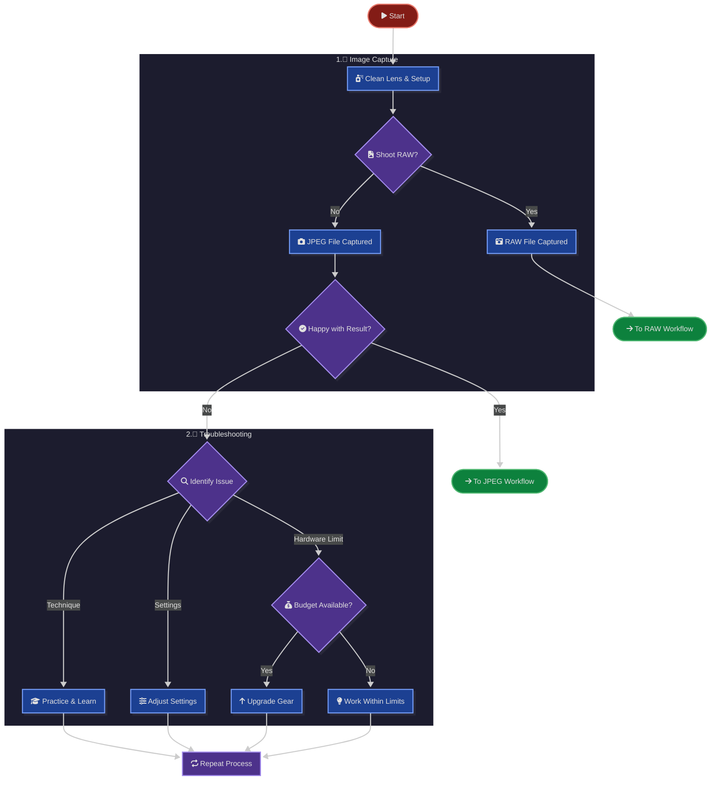

# Emulate-Film

### Take Photo

```mermaid
---
config:
  theme: redux-dark
  look: neo
  layout: dagre
---
flowchart TB

%% Subgraphs for Organization
  subgraph "1.📸 Image Capture"
    direction TB
    preparation["fa:fa-spray-can Clean Lens & Setup"]
    chooseFormat{"fa:fa-file-image Shoot RAW?"}
    captureRaw["fa:fa-camera-retro RAW File Captured"]
    captureJpeg["fa:fa-camera JPEG File Captured"]
    checkJpegResult{"fa:fa-check-circle Happy with Result?"}
  end

  subgraph "2.🔧 Troubleshooting"
    direction TB
    identifyIssue{"fa:fa-magnifying-glass Identify Issue"}
    practiceTechnique["fa:fa-graduation-cap Practice & Learn"]
    adjustSettings["fa:fa-sliders-h Adjust Settings"]
    checkBudget{"fa:fa-sack-dollar Budget Available?"}
    upgradeGear["fa:fa-arrow-up Upgrade Gear"]
    workWithinLimits["fa:fa-lightbulb Work Within Limits"]
  end

%% Main Workflow Logic
  start(["fa:fa-play Start"]) --> preparation
  preparation --> chooseFormat
  chooseFormat -- Yes --> captureRaw
  chooseFormat -- No --> captureJpeg

  captureRaw --> goToRawWorkflow(["fa:fa-arrow-right To RAW Workflow"])
  captureJpeg --> checkJpegResult

  checkJpegResult -- Yes --> goToJpegWorkflow(["fa:fa-arrow-right To JPEG Workflow"])
  checkJpegResult -- No --> identifyIssue

%% Troubleshooting Logic
  identifyIssue -- Technique --> practiceTechnique
  identifyIssue -- Settings --> adjustSettings
  identifyIssue -- Hardware Limit --> checkBudget

  checkBudget -- Yes --> upgradeGear
  checkBudget -- No --> workWithinLimits

%% Endpoints and Repeat Node
  practiceTechnique --> repeatProcess["fa:fa-repeat Repeat Process"]
  adjustSettings --> repeatProcess
  upgradeGear --> repeatProcess
  workWithinLimits --> repeatProcess

%% Styling Section
  %% Class Definitions for Node Types
  classDef startpoint fill:#831b16,stroke:#e8796c,stroke-width:2px
  classDef action fill:#1f4192,stroke:#739bf5,stroke-width:2px
  classDef decision fill:#4d328b,stroke:#a38ced,stroke-width:2px
  classDef endpoint fill:#08813e,stroke:#50b771,stroke-width:2px

  %% Apply Classes to Nodes (Cleaner Method)
  class start startpoint;
  class preparation,captureRaw,captureJpeg,practiceTechnique,adjustSettings,upgradeGear,workWithinLimits action;
  class chooseFormat,checkJpegResult,identifyIssue,checkBudget,repeatProcess decision;
  class goToRawWorkflow,goToJpegWorkflow endpoint;
```

### RAW Workflow (Denoise)

### JPEG Workflow (Correction)

### Davinci Resolve (Colour Grading)
